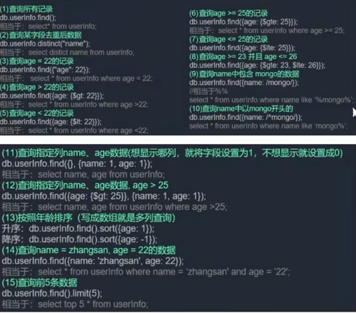
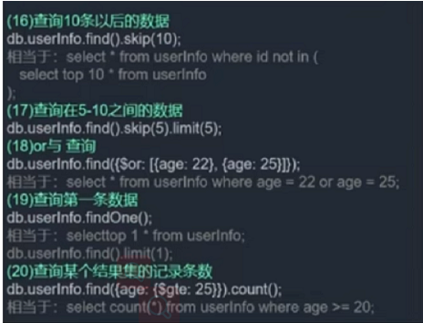

# 基础

## 关系型与非关系型数据库
[查看区别](/sakuras-docs/interview/after/%E6%95%B0%E6%8D%AE%E5%BA%93.html#_1-%E5%85%B3%E7%B3%BB%E5%9E%8B%E4%B8%8E%E9%9D%9E%E5%85%B3%E7%B3%BB%E5%9E%8B%E6%95%B0%E6%8D%AE%E5%BA%93%E5%8C%BA%E5%88%AB/)

## 安装数据库
[windows平台安装MongoDB](https://www.mongodb.org.cn/tutorial/55.html) \
[Linux平台安装MongoDB](https://www.mongodb.org.cn/tutorial/56.html)

## 启动Mongodb服务/连接数据库
若未配置全局变量，所有操作应在`/bin`目录下进行。
- `mongod --dbpath E:\mongodb\data\db`：启动mongoDB服务
- `mongo`：连接数据库

## 在命令行中操作
### 操作数据库
1. help查看命令提示
    - `help` 
    - `db.help()`
    - `db.数据库名.help()`
    - `db.数据库名.find.help()`
2. 创建/切换数据库
    - `use xxx` 创建或切换数据库（若创建数据库则通过show dbs默认不会被查到，需要在当前数据库新建一个集合）
3. 查询数据库
    - `show dbs` 查看都有哪些数据库
4. 查看当前数据库
    - `db`/`db.getName()`：查看当前数据库
5. 显示当前DB状态
    - `db.stats()`
6. 查看当前DB版本
    - `db.version()`
7. 查看当前DB的链接机器地址
    - `db.getMongo()`
8. 删除当前数据库
    - `db.dropDatabase()`

### 操作集合
1. 创建一个聚集集合
    - `db.createCollection("集合名称", { size: 5242880, capped: true, max: 5000 })`：最大存储空间为5M，最多5000个文档的集合
2. 得到指定名称的聚集集合
    - `db.getCollection(集合名称)`
3. 得到当前db的所有聚集集合
    - `db.getCollectionNames()`
4. 显示当前db所有聚集的状态
    - `db.printCollectionStats()`
5. 删除集合
    - `db.集合名称.drop()`

### 操作集合内文档
1. 给集合添加一个文档
    - `db.集合名称.save({ name: 'nmf', age: '30' })`：如果批量添加，则需要传数组形式的 `[{name:'xx',age:'xx'}, {name:'ss',age:'ss}]`
2. 查询该集合下的文档
    - `db.集合名称.find()`：默认查询所有，指定需要使用 `$gt`:大于 `$lt`:小于 `$gte`:大于等于 `$lte`:小于等于
     
    - `db.集合名称`：返回 数据库名称.集合名称
3. 更新文档
    - `db.集合名称.update({ username: 'nmf' }, { $set: {age: '200'} })`：$set覆盖，$inc运算(正值加法,负值剑法)
4. 删除文档
    - `db.集合名称.remove({ name: 'xx' })`：空对象{}删除该集合下所有的文档，否则为指定删除

## 在NodeJS中使用mongodb
### 基于`npm mongodb`
[详情见](https://www.mongodb.org.cn/drivers/5.html)
### 基于`npm mongoose`
[mongoose中文网](http://www.mongoosejs.net/)
> npm install mongoose
1. 新建个数据库相关的文件`db.config.js`
```js
/* db.config.js */
const mongoose = require('mongoose'); //数据库
//启动数据库
mongoose.connect('mongodb://localhost:27017/sakuras'); //插入集合和数据，数据库会自动创建

const db = mongoose.connection;

db.on('error',(err)=>{
	throw err
});

db.once('open',()=>{
	console.log('DB connected....');
});
```
2. 在启动node服务时候连接数据库
```js
/* app.js */
var express = require('express');

require('./db.config'); //启动数据库

var app = express();
//...
server.listen(port, ()=>{ console.log(`Server is listening on http://localhost:${port}/`) });
```
3. 想要在代码里进行数据库插入删除查询等操作，必须创建一个模型，一一对应数据库中的集合
```js
/* models/user.js */
const mongoose = require('mongoose');
const UserSchema = new mongoose.Schema({
  username:{
  	type:String
  },
  password:{
  	type:String
  },
  isAdmin:{
  	type:Boolean,
  	default:false//默认是普通用户
  },
  email:{
    type:String
  },
  phone:{
    type:String
  },
  cart:{
    type:CartSchema
  },
  shipping:{
    type:[ShippingSchema],
    default:[]
  }
},{
  timestamps:true
});
```

    

