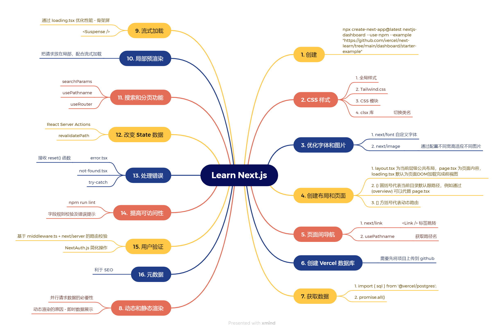

# 基础

Next.js 的页面路由 是一个全栈的 React 框架。它用途广泛，可让你创建任何规模的 React 应用程序——从大部分的静态博客到复杂的动态应用程序。

Next.js 由 Vercel 维护。你可以 将 Next.js 应用 部署到 Node.js 或 serverless 上，也可以部署到你自己的服务器上。完全静态的 Next.js 应用 可以部署在任何支持静态服务的地方。

<!--  -->
