# 后端服务

## 常规部署(NodeJS+MongoDB)
### 步骤
[如何将node+mongodb项目部署在腾讯云服务器，并进行性能优化的](http://www.manongjc.com/detail/54-jvbptcxlqkplepa.html)
### 常见问题
1. C++ compiler (CXX=g++, 4.8.5) too old, need g++ 6.3.0.
```
root@xxx node-v12.18.2]# ./configure
WARNING: C++ compiler (CXX=g++, 4.8.5) too old, need g++ 6.3.0 or clang++ 8.0.0
WARNING: warnings were emitted in the configure phase
INFO: configure completed successfully
[root@xxx node-v12.18.2]# gcc -v
gcc version 4.8.5 20150623 (Red Hat 4.8.5-39) (GCC) 
```
- 原因：安装nodejs时报错，c++版本太低，无法编译nodejs源码
- 解决：[查看](https://blog.csdn.net/w345731923/article/details/107204098/)
> 注意：如果 `gcc -v` 查看仍然是老版本，需要关闭整个shell软件重新打开

## 宝塔部署
[详细过程](https://blog.csdn.net/qq_48960335/article/details/124547403)

### 安装宝塔
- 在Linux中卸载宝塔：
> [root@VM-4-12-centos /]# wget http://download.bt.cn/install/bt-uninstall.sh \
> [root@VM-4-12-centos /]# sh bt-uninstall.sh

- 在Linux中安装宝塔：
    - 登录宝塔官网，选择`在线一键快速安装宝塔`，填写服务器ip，端口号，立即安装到服务器，安装前会有插件选项，我选择的是nginx；

    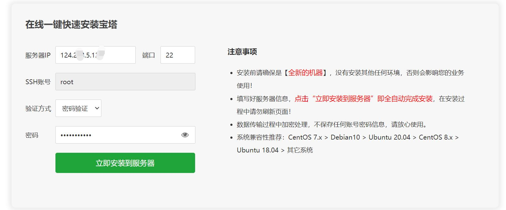
    - 安装完成后，会给登录的地址，账号和密码，登录到控制台即可；

    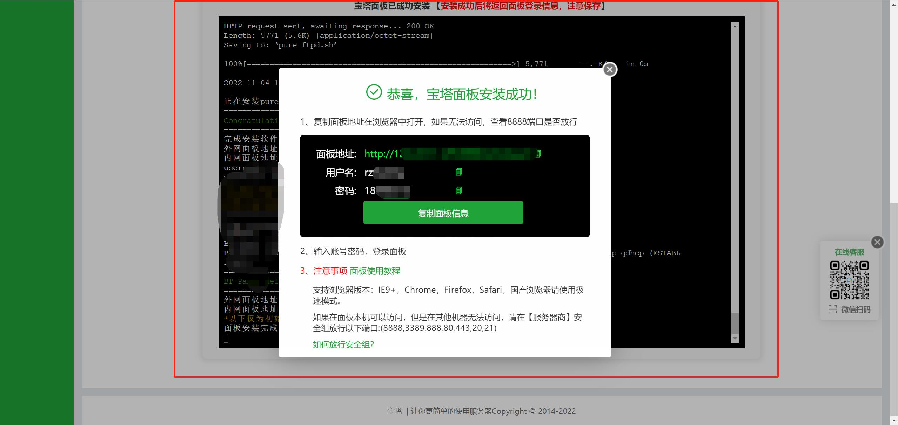
    - 在软件商店，选择`pm2`和`mongoDB`进行安装(可以在终端中通过`node-v`检查node环境是否安装成功)，下面是我已经安装过的插件；

### 简单部署vue项目
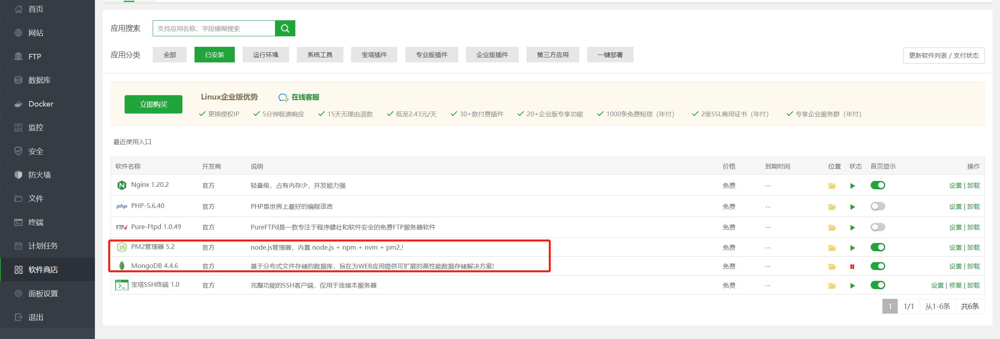
- 安装完毕之后，可以去修改nginx配置文件(假设你已经购买了域名并且进行了域名解析网站备案等)，将提前打包好的前端项目部署上去，可以自己新建文件夹也可以用已有的路径，我的前端项目都部署在`/app`下面；

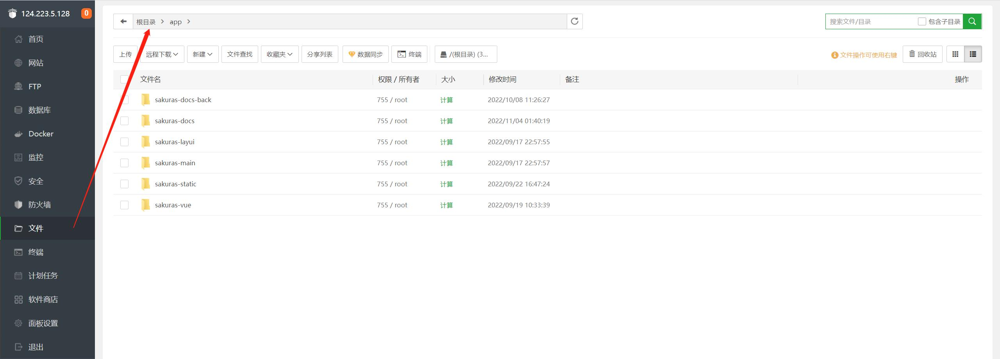

- 接下来再修改`nginx/nginx.conf`文件，并且在`腾讯云服务器的防火墙`设置里和`宝塔安全`设置里放行`80`端口，然后通过http+ip地址访问网站；

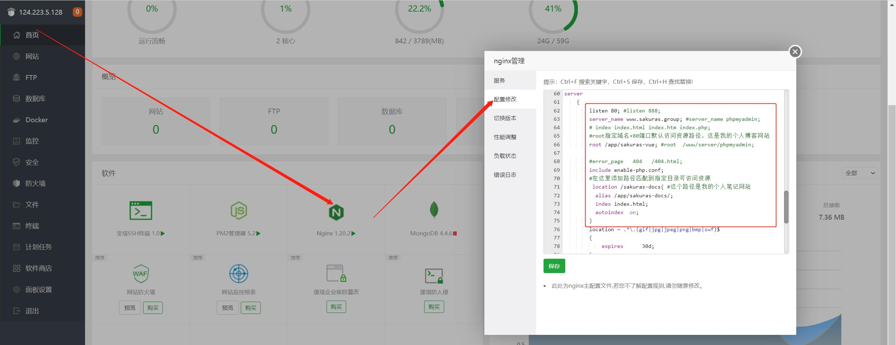
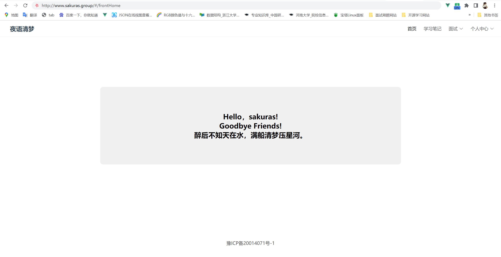

- 如果需要开启`https`访问，则需要提前申请好`ssl证书`，我之前已经申请过了，所以这次直接加到nginx的配置文件里即可，配置完之后就可以通过域名访问https协议的网站啦；

    - 以下是`nginx.conf`配置文件的server部分：
    ```
    server {
        listen       80; //默认监听80端口
        server_name  www.sakuras.group; 
        return 301 https://www.sakuras.group; //在这里每次输入域名sakuras.group http访问，即可强制重定向到https访问
        # permanent是301永久重定向，redirect是302临时重定向
    }
    server {
        listen 	  443 ssl http2 default_server; //监听ssl 443端口，提前在服务器控制台放行443端口
        listen       [::]:443 ssl http2 default_server; 	
        server_name  www.sakuras.group;
        ssl on; 
        ssl_certificate sakuras.group_bundle.pem; #证书文件名称
        ssl_certificate_key 2_sakuras.group.key; #私钥文件名称
        ssl_session_cache shared:SSL:1m;
        ssl_session_timeout  10m;
        ssl_ciphers HIGH:!aNULL:!MD5;
        ssl_prefer_server_ciphers on;
        root /app/sakuras-vue; #root指定域名+80端口默认访问资源路径，这是我的个人博客网站
    
        #在这里添加路径匹配到指定目录可访问资源
        location /sakuras-docs{ #这个路径是我的个人笔记网站
                alias /app/sakuras-docs/;
                index index.html;
                autoindex  on;
        }
    }
    ```
    
### 简单部署node项目
- 首先，我们虽然安装了`pm2`，但是还没有安装node具体的版本环境，我们可以在pm2管理器里选择Node版本，在切换的下拉列表里选择我们想要的版本，建议版本不低于我们node项目的版本；

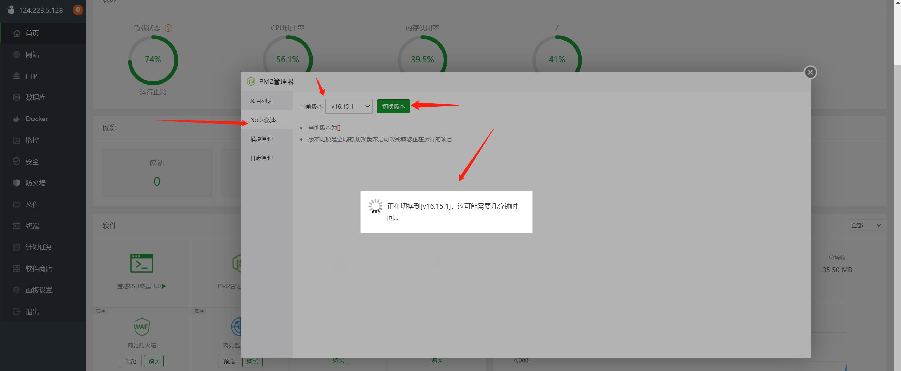

- 接下来，把我们简易的node项目上传到服务器上任意的目录即可（注意不要上传`node_modules`文件夹），然后在终端中`cd`到node项目跟目录里，执行`npm isntall`，下载项目所需的相关依赖；

- 然后我们在`pm2`管理器里，添加我们的node项目，因为通过pm2启动的node服务不会随着终端的关闭而进程消失；
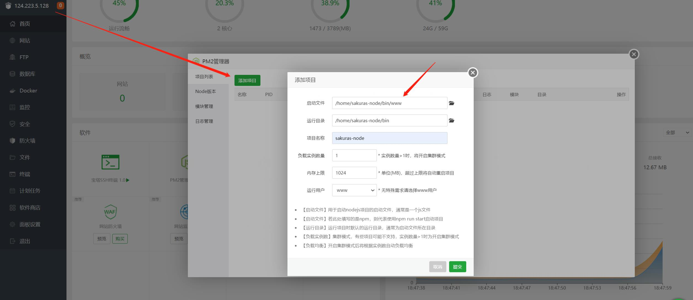

- 到这一步还是不能访问接口，比如我的测试接口是`https://sakuras.group/sakuras-api/user/test`，这样子是不可以访问的，因为`/sakuras-api`会被当做是一个静态资源路径，如果不存在会返回`404`，所以我们需要继续在nginx里配置代理，如果访问到`/sakuras-api`，我们想让它成为接口，所以把这个请求转发到当前操作系统上的node服务所在的端口上，比如`http://127.0.0.1:5555/sakuras-api`；

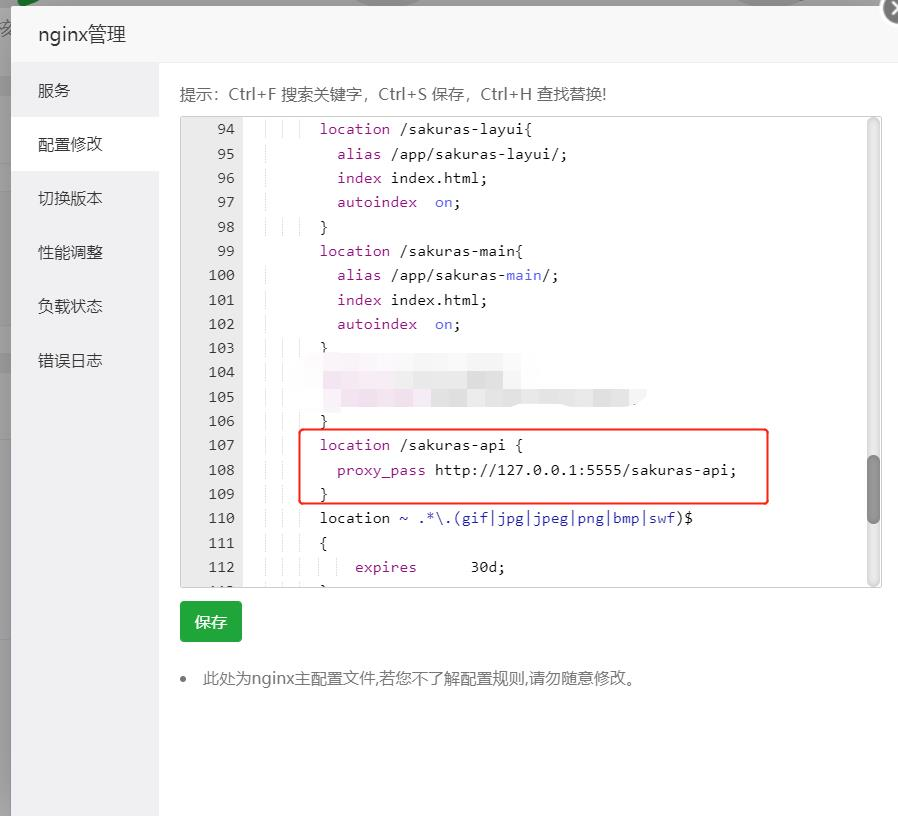
- 然后我们就可以通过`域名/ip地址 + 接口api路由` 访问我们的接口啦~

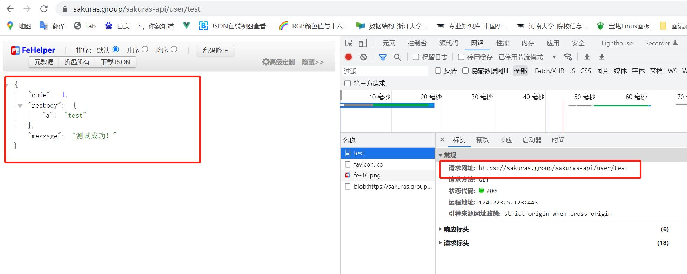

### 连接数据库
- 在宝塔Linux面板的软件商店里，搜索`mongoDB`并安装；

- 并且打开`MongoDB`，在配置项里把BindIP改为`0.0.0.0`，目的是为了支持本地开发时后台服务直接连接到远程数据库，操作服务器里的数据库；

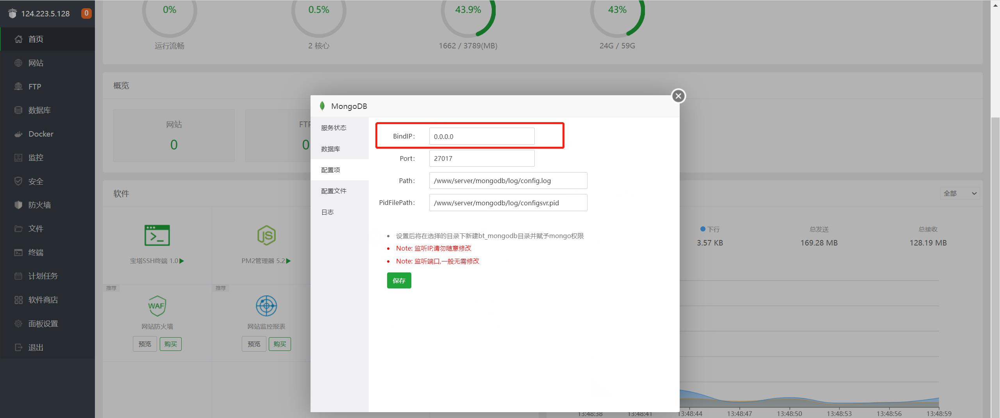
- 然后启动MongoDB的服务状态即可，如果启动失败，则可以根据日志提示找出错误解决，必须启动成功才可以进行下一步。

- 如果我们在本地开发环境，我们需要在本地node服务项目里，连接到远程数据库，因为之前我们已经把BindIP修改为了`0.0.0.0`，所以直接连接即可；
    - node项目启动文件
    ```js
    var express = require('express');
    var path = require('path');
    var cookieParser = require('cookie-parser');
    var logger = require('morgan');

    var indexRouter = require('./routes/index');
    var usersRouter = require('./routes/user');

    require('./db.config'); //启动数据库

    var app = express();

    app.use(express.json());
    app.use(express.urlencoded({ extended: false }));
    app.use(cookieParser());
    app.use(express.static(path.join(__dirname, 'public')));

    app.use('/sakuras-api', indexRouter);
    app.use('/sakuras-api/user', usersRouter);

    app.use(function(req, res, next) {
        next(createError(404));
    });
    app.use(function(err, req, res, next) {
        res.locals.message = err.message;
        res.locals.error = req.app.get('env') === 'development' ? err : {};
        res.status(err.status || 500);
        res.render('error');
    });
    module.exports = app;
    ```
    - node项目中连接数据库文件`db.config.js`
    ```js
    const mongoose = require('mongoose'); //数据库
    //启动数据库 插入集合和数据，数据库会自动创建
    // mongoose.connect('mongodb://127.0.0.1:27017/sakuras'); //本地数据库
    mongoose.connect('mongodb://124.223.5.128:27017/sakuras'); //通过本地连接远程数据库

    const db = mongoose.connection;

    db.on('error',(err)=>{ 
        throw err;
    });

    db.once('open',()=>{ 
        console.log('DB connected....');
    });
    ```
